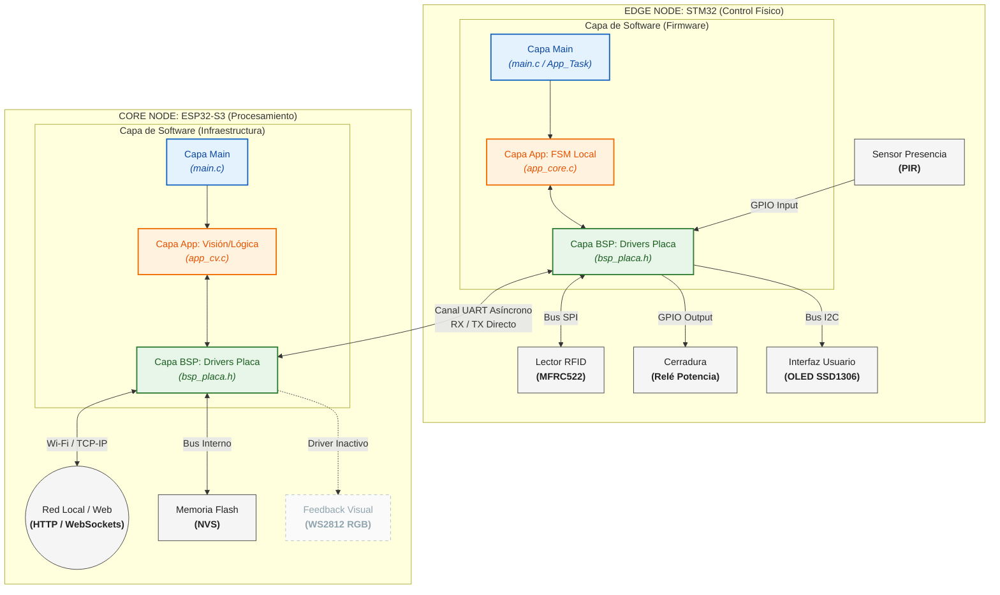
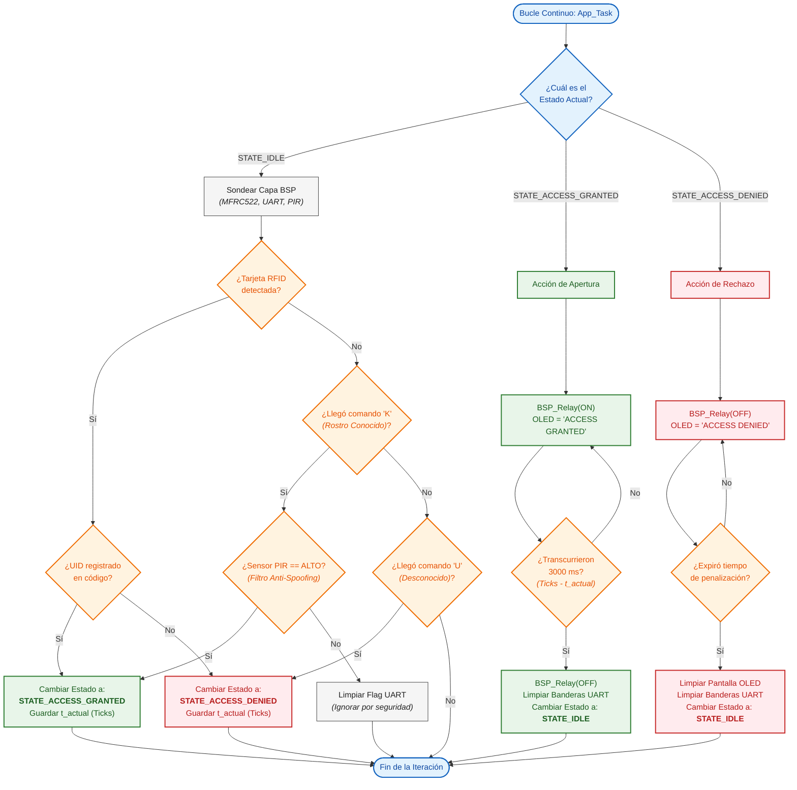

# Sistema de Control de Acceso Distribuido (STM32 + ESP32-S3)

Este repositorio contiene el código fuente para un **Sistema de Control de Acceso Distribuido**. El proyecto resuelve la necesidad de validar ingresos físicos mediante autenticación de doble factor (RFID local y Visión Artificial remota), dividiendo las responsabilidades computacionales y de control físico entre dos microcontroladores distintos.

Esta arquitectura de "doble nodo" permite aislar y proteger la interacción física en tiempo real, delegando las tareas de procesamiento intensivo, almacenamiento de datos y conectividad web a un nodo especializado.

---

## Filosofía de Diseño: Arquitectura de Nodos

El sistema abandona el paradigma monolítico clásico para operar bajo una topología de **Nodo de Borde (Edge Node)** y **Nodo Central (Core Node)**.

### 1. Nodo Físico / Edge Node (STM32)

Su prioridad absoluta es garantizar la seguridad física y proporcionar una respuesta determinista en tiempo real.

* **Responsabilidades:** Gestión del lector de tarjetas RFID (MFRC522), lectura del sensor de presencia volumétrica (PIR), control de la interfaz visual de usuario (OLED SSD1306) y accionamiento de potencia del relé de la cerradura electromecánica.
* **Estado de Hardware:** Implementado transitoriamente en una tarjeta de desarrollo **NUCLEO-L476RG**. La estructura del firmware está diseñada para garantizar una migración directa y transparente hacia la placa definitiva: una **PCB personalizada basada en el microcontrolador STM32F0**.

### 2. Nodo Central / Core Node (ESP32-S3)

Actúa como el motor computacional del sistema. Gestiona tareas asíncronas de alta carga que comprometerían el tiempo de respuesta del nodo STM32.

* **Responsabilidades:** Procesamiento de algoritmos de visión artificial, gestión de conectividad inalámbrica, alojamiento del servidor HTTP/WebSockets y registro persistente de eventos en memoria no volátil.
* **Nota sobre Retroalimentación Visual (LEDs):** Aunque la capa BSP del ESP32 incorpora el controlador para tiras LED direccionables WS2812 (`bsp_led`), **esta funcionalidad se encuentra inactiva en el flujo principal (`main`) y en la máquina de estados actual**. Las notificaciones visuales del sistema operan exclusivamente a través de la pantalla OLED del STM32.

---

## Diagrama de Bloques del Sistema

El siguiente diagrama ilustra la separación de recursos de hardware y el puente de comunicación asíncrona entre ambas arquitecturas:



---

## Arquitectura de Software (Strict 3-Layer Architecture)

Para facilitar la inminente migración de hardware (de Nucleo a la PCB personalizada) sin necesidad de refactorizar la lógica central, **ambos microcontroladores** implementan de forma rigurosa una arquitectura de software de tres capas. La totalidad del código fuente está redactada en inglés.

1. **Capa BSP (Board Support Package):** Modularizada por componente físico (ej. `bsp_uart.c`, `bsp_rfid.c`). Es la **única capa autorizada** para interactuar con las bibliotecas del fabricante (HAL de STM32 o ESP-IDF) y manipular registros físicos. Todos los submódulos convergen en un archivo maestro `bsp_placa.h`.
2. **Capa App (Business Logic):** Modularizada por funcionalidad (ej. `app_core.c`, `app_cv.c`). Es completamente agnóstica al hardware; está **estrictamente prohibida** la inclusión de directivas de registros o manejo de periféricos a este nivel. Contiene las máquinas de estado y expone sus interfaces a través de `app.h`.
3. **Capa Main:** Diseñada con un enfoque minimalista. Únicamente incluye `app.h`, ejecuta la inicialización global (`App_Init()`) y mantiene un bucle infinito dedicado de forma exclusiva a la invocación de `App_Task()`.

---

## Flujo de Ejecución y Casos de Uso

El núcleo operativo del sistema reside en la Máquina de Estados Finitos (FSM) ejecutada en la capa de aplicación del STM32 (`app_core.c`). Este bucle principal (`App_Task`) opera de manera estrictamente asíncrona, evitando bloqueos por funciones de retardo.

### Estado Inicial: `STATE_IDLE`

Representa el estado de reposo y vigilancia. El relé permanece desenergizado (cerradura bloqueada). La pantalla OLED se limpia o muestra un mensaje de espera. En cada iteración del bucle, el STM32 ejecuta tres acciones:

1. Interroga el bus SPI para detectar la presencia de una tarjeta en el lector RFID.
2. Verifica si la rutina de interrupción UART ha señalado la recepción de un comando desde el ESP32.
3. Evalúa el estado lógico del pin asociado al sensor PIR.

A partir de este estado de vigilancia, pueden desencadenarse tres eventos principales:

### Caso 1: Ingreso Concedido por RFID (Validación Local)

1. El usuario aproxima un transpondedor RFID al lector.
2. La capa BSP extrae el UID de la tarjeta y lo transfiere a la capa App.
3. La capa App compara el UID contra la base de datos almacenada localmente.
4. **Al verificar una coincidencia**, la FSM transiciona a `STATE_ACCESS_GRANTED`.
5. Se comanda al BSP para energizar el relé y liberar la cerradura. El display OLED indica **"ACCESS GRANTED"**.
6. Se captura la marca de tiempo actual (`BSP_GetTicks()`). Una vez expirado el intervalo de apertura preconfigurado (ej. 3000 ms), el sistema revierte automáticamente a `STATE_IDLE`.

### Caso 2: Ingreso Concedido por Visión Artificial (Validación Remota + Físico)

1. El ESP32-S3 captura y procesa continuamente secuencias de video buscando identificar un rostro válido.
2. Tras identificar positivamente a un usuario autorizado, el ESP32 transmite un byte de confirmación vía UART: `'K'` (*Known*).
3. La interfaz UART del STM32 recibe el byte asíncronamente y activa una bandera de validación.
4. En el siguiente ciclo de `STATE_IDLE`, la capa App detecta esta bandera y ejecuta la comprobación de **Seguridad de Factor Físico**:
* *¿Se recibió la validación `'K'` y, simultáneamente, el sensor PIR registra nivel ALTO (confirmando la presencia física frente a la puerta)?*


5. Si ambas condiciones se cumplen (mitigando vulnerabilidades por suplantación fotográfica), la FSM transiciona a `STATE_ACCESS_GRANTED` y procede con la rutina de apertura.

### Caso 3: Ingreso Denegado

Este escenario se activa bajo dos premisas:

* **Rechazo Local:** Se detecta una tarjeta RFID, pero su UID no existe en los registros locales.
* **Rechazo Remoto:** El ESP32 procesa un rostro no autorizado y transmite el byte `'U'` (*Unknown*).
* **Flujo Operativo:** La FSM transiciona a `STATE_ACCESS_DENIED`. El relé conserva su estado inactivo (seguridad en modo a prueba de fallos). El display OLED muestra **"ACCESS DENIED"** durante un periodo de penalización, tras el cual la pantalla se limpia y el sistema retorna a `STATE_IDLE`.



---

## Estructura del Repositorio

El repositorio separa de forma lógica y física los entornos de desarrollo para prevenir conflictos entre dependencias, agilizar el proceso de compilación y centralizar la documentación de hardware.

```text
/
├── PCB-Design/                        # Archivos de hardware y manufactura de la PCB custom
│   ├── Altium/                        # Archivos fuente de Altium Designer (esquemáticos, PCB layout)
│   └── gerbers.zip                    # Archivos Gerber listos para fabricación (basada en STM32F0)
│
├── esp32-s3-control-access-final/     # Firmware del ESP32-S3
│   ├── main/                          # Código fuente (App, BSP, Main)
│   ├── CMakeLists.txt                 # Sistema de construcción de ESP-IDF
│   └── partitions.csv                 # Mapa de particiones NVS y de la aplicación
│
├── stm32-nucleo-l476rg-control-access/# Firmware del STM32
│   ├── src/                           # Código fuente (App, BSP, Main)
│   ├── platformio.ini                 # Configuración de entorno y especificación de hardware
│   └── README.md                      # Documentación para la migración a STM32F0
│
└── proyecto.code-workspace            # Espacio de trabajo integrado para Visual Studio Code

```

## Herramientas de Desarrollo

* **Entorno STM32:** El desarrollo, compilación y despliegue se administran a través del ecosistema **PlatformIO**.
* **Entorno ESP32-S3:** El desarrollo se rige estrictamente por la **extensión oficial de ESP-IDF** para VS Code, empleando CMake como sistema de construcción nativo.
* **Diseño de Hardware:** La captura esquemática y el diseño de la placa de circuito impreso (PCB) se realizan en **Altium Designer**, generando los archivos estandarizados Gerber para la manufactura física.